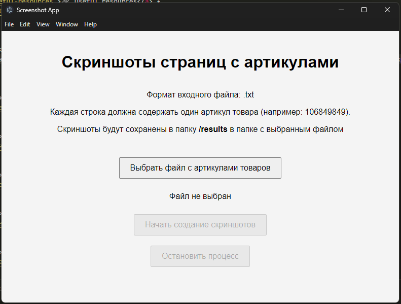
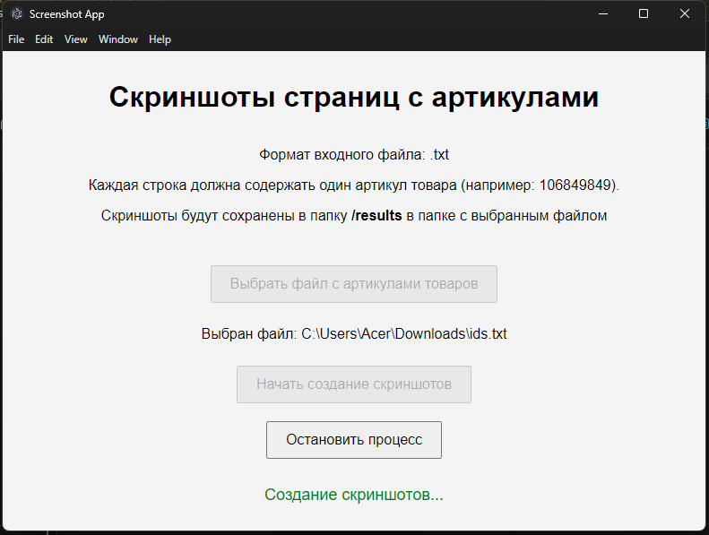
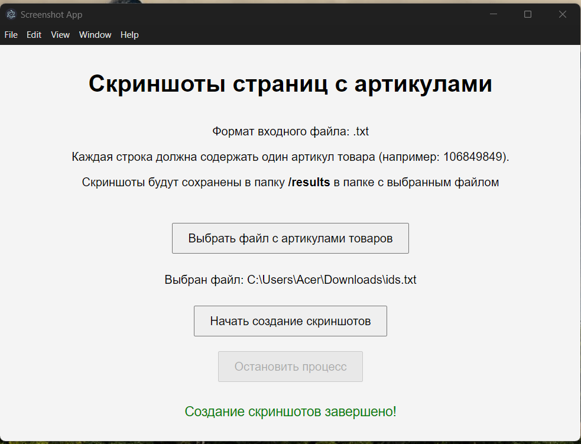

<h1 align="center">WildBerries Screenshot App</h1>
<p align="center">
  Made with <code>HTML</code>, <code>CSS</code>, <code>JavaScript</code>, <code>Electron</code>
  <br>
  Bootstrapped with <code>Electron</code>
</p>

<p align="center">
  <a href="../../commits"></a>
  <a href="./LICENSE"></a>
  
</p>

<p align="center">
  <a href="#-screenshots">🖼 Screenshots</a> • 
  <a href="#ℹ%EF%B8%8F-about">ℹ️ About</a> • 
  <a href="#%EF%B8%8F-tools">⚙️ Tools</a> • 
  <a href="#-build-project">🔨 How to Build Project</a> • 
  <a href="#-file-structure">📁 File Structure</a>
</p>

<sup>
  <p align="center">
    <a href="#-npm-packages-worth-mentioning">📦 NPM Packages worth mentioning</a> • 
    <a href="#-details">💡 Details</a> • 
    <a href="#-useful-resources">🔗 Useful resources</a> • 
    <a href="#-author">👤 Author</a>
  </p>
</sup>

<h2 align="center">ChatGPT Disclaimer!!!</h2>
<p align="center">The code was largely written by ChatGPT v4o. I made some changes, but they were relatively minor. I've not had any prior experience with Electron. Take into account those facts!

## 🖼 Screenshots

<p align="center">
  
</p>

<p align="center">
  
</p>

<p align="center">
  
</p>

## ℹ️ About

A friend of mine once asked me: "hey, I know, you're a programmer, could you programm some stuff for me?"

She asked me to create an app that might help her optimize some portion of her and her colleagues' manual work. They had to manually visit the pages and save screenshots of WildBerries (russian online market) pages for some legal stuff. The problem was that there were hundreds and hundreds of those pages. That required some automation.

I've never faced such a task. First things first I asked all details, clarified preliminarry requirements. Thus I decided to use ChatGPT to come up with a prototype. Showed it to her, she made some corrections. Then finally I came up with a solution that satisfied her.

After that I decided to turn that solution from a simple Node app into an Electron app so she doesn't have to bother with installing all dependencies.

Good news: it worked. Bad news: she has to install all dependencies because for some reason that .exe file created by Electron refused to launch Chromium based browser for screenshots (alas!) although other parts of the app work, that's very, very strange. Don't know how to fix it

### How it works

You write down ids of Wildberries products in a text file and separate them by a newline character

E.g. for `https://www.wildberries.ru/catalog/218924051/detail.aspx` the id will be `218924051`

So you get a text file that might look like this:

```txt
104870004
228056127
149564395
219783704
233059870
```

Launch the app. From .exe if you build it, or via `npm start`

Select a file. There is a button for that (sorry, but everything is in Russian there)

Launch screenshot action. There is another button for that also in Russian

There will show a browser that will open the pages. E.g. for id `218924051` it will open the page `https://www.wildberries.ru/catalog/218924051/detail.aspx` and so on. Then it will make screenshots of those pages and close the browser

The results will be in the same folder as the file with ids in a folder named `results`

## ⚙️ Tools

- **HTML5**
- **CSS**
- **JavaScript**
  - Electron

## 🔨 Build project

<table>
  <tr>
    <th>Command</th>
    <th>Description</th>
  </tr>
  <tr>
    <td><code>npm&nbsp;i</code></td>
    <td>First things first, install all required packages</td>
  </tr>
  <tr>
    <td><code>npm&nbsp;run&nbsp;start</code></td>
    <td>Run the app in development mode</td>
  </tr>
  <tr>
    <td><code>npm&nbsp;run&nbsp;dist</code></td>
    <td>Build the Electron app into Windows .exe</td>
  </tr>
</table>

## 📁 File Structure

```Markdown
|
├── 📁 docs                   Screenshots of app working, a sample file with ids, sample results of app work
|
├── 📁 honorable_mention      Previous, simplified, yet working versions of the app
|
├── 📝 .gitignore             Instructions for Git about what files to ignore
├── 📝 index.html             Root html file
├── 📝 LICENSE                MIT License. Basically you can do whatever you want with the code
├── 📝 main.js                Root js file for Electron
├── 📝 package-lock.json      Keeps track of the exact version of every package that is installed
├── 📝 package.json           Various metadata relevant to the project, scripts, dependencies
├── 📝 README.md              Project description
└── 📝 renderer.js            Another js file for Electron
```

## 📦 NPM Packages worth mentioning

- `puppeteer` - library that helps to launch and close a browser, visit pages
- `screenshot-desktop` - used to make, guess what, screenshots of a desktop

## 💡 Details

### Electron

If you use Windows launch and wanna build the app with Electron use Admin rights when you launch a console! Otherwise you'll get some random errors that are impossible to fix

### ChatGPT

That thing helped me to quickly create this app

## 🔗 Useful resources

ChatGPT
